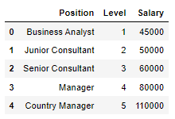
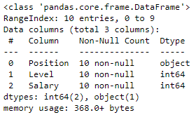
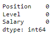
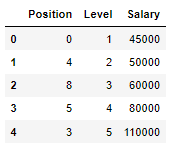
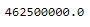
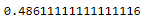
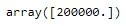

# Implementation-of-Decision-Tree-Regressor-Model-for-Predicting-the-Salary-of-the-Employee

## AIM:
To write a program to implement the Decision Tree Regressor Model for Predicting the Salary of the Employee.

## Equipments Required:
1. Hardware – PCs
2. Anaconda – Python 3.7 Installation / Moodle-Code Runner

## Algorithm
1. Import the required libraries.
2. Upload and read the dataset.
3. Gather information and presence of null in the dataset.
4. From sklearn.tree import DecisionTreeRegressor and fir the model.
5. Find the mean square error and r squared score value of the model.
6. Check the trained model.

## Program:
```
/*
Program to implement the Decision Tree Regressor Model for Predicting the Salary of the Employee.
Developed by: Lathika Sunder
RegisterNumber: 212221230054
*/
```
```python
#import packages
import pandas as pd
df=pd.read_csv("Salary.csv")
df.head()

#checking the data information and null presence
df.info()
df.isnull().sum()

#encoding categorical features to numeric
from sklearn.preprocessing import LabelEncoder
le=LabelEncoder()
df["Position"] = le.fit_transform(df["Position"])
df.head()

#assigning x and y 
x = df[["Position","Level"]]
y = df["Salary"]

#splitting data into training and test
#implementing decision tree regressor in training model
from sklearn.model_selection import train_test_split
x_train,x_test,y_train,y_test = train_test_split(x,y,test_size=0.2,random_state=2)

from sklearn.tree import DecisionTreeRegressor
dt = DecisionTreeRegressor()
dt.fit(x_train,y_train)
y_pred = dt.predict(x_test)

#calculating mean square error
from sklearn import metrics
mse = metrics.mean_squared_error(y_test,y_pred)
mse

#calculating r square value
r2 = metrics.r2_score(y_test,y_pred)
r2

#testing the model
dt.predict([[5,6]])
```

## Output:
### Initial Dataset:

### Dataset information:



### Encoded Dataset:

### Mean Square Error value:

### R squared score:

### Result value of Model when tested:



## Result:
Thus the program to implement the Decision Tree Regressor Model for Predicting the Salary of the Employee is written and verified using python programming.